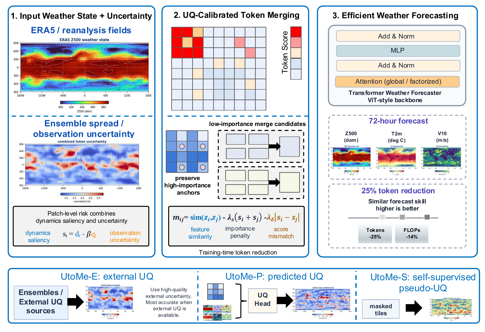
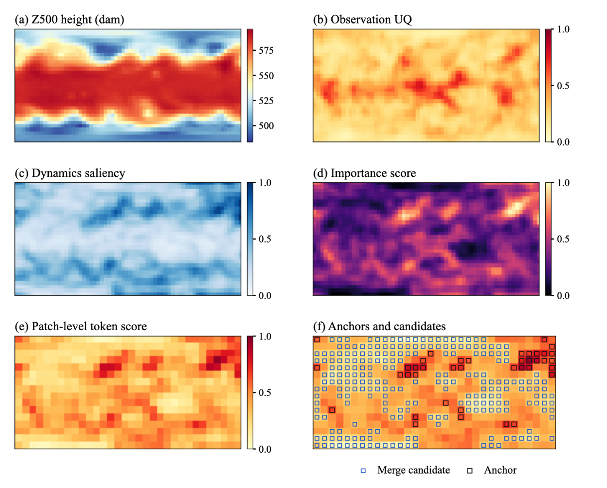
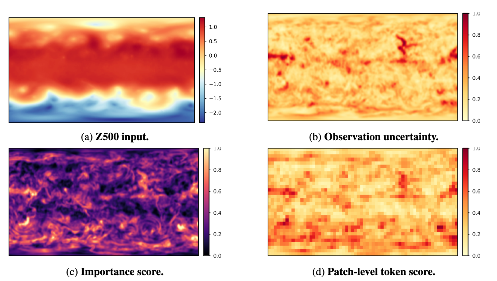

<h1 align="center">UtoMe: Observation-Uncertainty-Guided Token Merging<br>for Weather Foundation Models</h1>

<p align="center">
  Yunbei Zhang<sup>1,2,*,†</sup> · Janet Wang<sup>1,2,*</sup> · Xi Xiao<sup>2</sup> · Jihun Hamm<sup>1</sup> · Xiao Wang<sup>2,†</sup>
</p>

<p align="center">
  <sup>1</sup>Tulane University &nbsp; <sup>2</sup>Oak Ridge National Laboratory
</p>

<p align="center">
  <sup>*</sup>Equal contribution &nbsp; <sup>†</sup>Corresponding authors
</p>

<p align="center">
  <a href="https://ornl-utome.github.io"></a>
  
  <a href="https://ornl-utome.github.io/assets/UtoMe.pdf"></a>
  <a href="LICENSE"></a>
</p>

> This work was done during an internship at **Oak Ridge National Laboratory (ORNL)**.

Correspondence: [Yunbei Zhang](mailto:yzhang111@tulane.edu), [Xiao Wang](mailto:wangx2@ornl.gov).

## Method

UtoMe uses observation uncertainty to guide training-time token merging for transformer-based weather forecasting. It turns weather-state saliency and low observation uncertainty into a patch-level token score, then uses that score to protect forecast-sensitive anchors and merge lower-importance redundant tokens.



| Variant | External uncertainty |
|---|---|
| **UtoMe-E** | Used at both training and inference |
| **UtoMe-P** | Used during training only, through a learned importance predictor |
| **UtoMe-S** | Not used; learns from a local spatial-inconsistency proxy |

## Run

Use Python 3.10+ with a working **ROCm PyTorch** installation on AMD GPUs, then:

```bash
pip install -e .
python scripts/train_global_forecast.py --config configs/5p625/utome_e_25.yaml
```

Set `data.root_dir` (ERA5) and `data.uq_root_dir` (EDA spread for E/P) in the YAML. Match `trainer.devices` and `trainer.num_nodes` to your allocation. Data layout: [docs/data.md](docs/data.md).

Configs cover both resolutions, E/P/S at 25% and 50% reduction, ToMe, and no merging (`base.yaml`). For Frontier, activate your ROCm environment and run:

```bash
sbatch --account=<allocation> scripts/train_amd.sbatch configs/1p40625/utome_e_50.yaml
```

Test a saved checkpoint with:

```bash
python scripts/train_global_forecast.py --config configs/5p625/utome_e_25.yaml --test-only --ckpt outputs/5p625/utome_e_25/checkpoints/last.ckpt
```

UtoMe-P testing needs no EDA fields. UtoMe-S needs none at either stage. Run the small CPU checks with `python -m unittest discover -s tests`.

## Results

Main results on 1.40625° ERA5 72-hour forecasting. Values are means over three seeds from the paper. Lower is better for Overall and per-variable wRMSE; higher is better for ACC. Compute is the encoder FLOPs ratio relative to no merging. Bold values are best within each token budget.

| Method | Overall ↓ | ACC ↑ | Z500 ↓ | T850 ↓ | T2m ↓ | U10 ↓ | V10 ↓ | Compute ↓ |
|---|---|---|---|---|---|---|---|---|
| No merging | 32.41 | 0.964 | 156.76 | 1.299 | 1.269 | 1.339 | 1.360 | 1.00× |
| *25% token reduction* | | | | | | | | |
| ToMe | 42.45 | 0.949 | 206.02 | 1.452 | 1.483 | 1.572 | 1.724 | 0.86× |
| UtoMe-E | **39.59** | **0.952** | **191.93** | **1.413** | **1.454** | **1.527** | **1.645** | 0.86× |
| UtoMe-P | 39.60 | **0.952** | 191.98 | 1.425 | 1.459 | 1.530 | 1.648 | 0.87× |
| UtoMe-S | 39.84 | 0.951 | 193.14 | 1.416 | 1.458 | 1.533 | 1.656 | 0.87× |
| *50% token reduction* | | | | | | | | |
| ToMe | 67.32 | 0.905 | 328.21 | 1.846 | 2.056 | 2.136 | 2.347 | 0.55× |
| UtoMe-E | **53.00** | **0.913** | **256.72** | 1.759 | 2.051 | 2.038 | 2.433 | 0.55× |
| UtoMe-P | 53.14 | 0.907 | 257.37 | 1.762 | 2.056 | 2.045 | 2.444 | 0.57× |
| UtoMe-S | 57.01 | 0.908 | 276.99 | **1.752** | **1.968** | **2.009** | **2.335** | 0.57× |

## Case studies



*5.625° case summary: weather state, observation uncertainty, dynamics saliency, importance score, patch-level token score, and the final anchor or merge-candidate overlay.*



*1.40625° high-resolution case study: Z500 input, observation uncertainty, importance score, and patch-level token score.*

## Acknowledgements

This research was supported by ORNL's AI Initiative, sponsored by the Director's Research and Development Program at ORNL. Computing time was provided through the Oak Ridge Leadership Computing Facility. The manuscript was authored by UT-Battelle, LLC, under contract DE-AC05-00OR22725 with the US Department of Energy (DOE).

## Citation

```bibtex
@inproceedings{zhang2026utome,
  title     = {UtoMe: Observation-Uncertainty-Guided Token Merging for Weather Foundation Models},
  author    = {Zhang, Yunbei and Wang, Janet and Xiao, Xi and Hamm, Jihun and Wang, Xiao},
  booktitle = {Advances in Neural Information Processing Systems (NeurIPS)},
  year      = {2026}
}
```

## License

Code and configurations use [CC BY-NC 4.0](LICENSE): noncommercial reuse and modification with attribution. Upstream notices and the earlier MIT notice are retained in [THIRD_PARTY_NOTICES.md](THIRD_PARTY_NOTICES.md).
